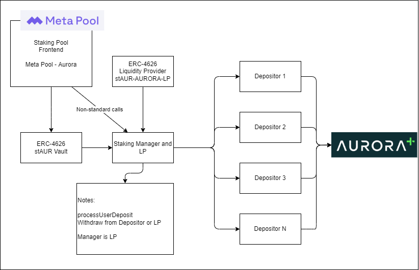

# Staking Pool Aurora

Meta Staking pool in Aurora.

# Aurora Bounty ETHDenver2023

We have been working on the stAUR, which is the liquid staking token that represent a proportion of the total Auroras staked into Aurora.plus by the N number of depositors. A good number of depositors to start with is with 3.

The **Depositors** are smart contracts that deposit Aurora into the staking service. The objective of spliting the deposits into multiple depositors is to allow deposits from one depositor, keeping the other two of them without the redeem penalization.

Three different contracts are needed to be deployed.

- The stAUR fungible token: ERC20, ERC4626.
- The staking manager is the contract than contains all the logic to stake, unstake and the stAUR-AURORA liquidity pool.
- The depositors are separated smart contracts that have the logic to deposit and withdraw from the Aurora plus staking service.

Using the Aurora SDK, after the liquidity pool is developed, the stAUR token could be used directy in Meta Yield.



Address for the Staking Pool in Aurora Mainnet.

```js
  // These are the addresses of the Aurora Token and Aurora Plus in Mainnet.
  const TokenAddress = "0x8BEc47865aDe3B172A928df8f990Bc7f2A3b9f79";
  const AuroraStakingAddress = "0xccc2b1aD21666A5847A804a73a41F904C4a4A0Ec";

  // These are the addresses of the contracts Meta Pool deployed.
  const StakingManagerAddress = "0xd239cd3A5Dec2d2cb12fB8eC512Fe3790FA2cD0e";
  const Depositor00Address = "0x6fA37581EBA252C08240c85f30fA8A5e3462c09d";
  const Depositor01Address = "0x31e0752Deb99f1fCE9701Dc5611A1652189dEdC3";
  const StakedAuroraVaultAddress = "0xA68118a4A067354A73C657300337d08E9753fB3D";
```

Try me in Aurora Mainnet:

We started with 100 Aurora tokens. 20 were sent to Alice and 40 to Bob. Alice deposited 20 Aurora and received 20 stAUR, since this was the first deposit the ratio is 1-by-1. The next deposit is for 35 Auroras and Bob received `34.999`.

```sh
npx hardhat run scripts/check_status.js --network aurora_mainnet
# Contract status: =================================
# alice stAUR: 20000000000000000000
# alice AUROR: 0
# bob stAUR: 34999923905739695523
# bob AUROR: 5000000000000000000
```


# Deployment in Goerli

The branch that is deployed

First, the contracts will be deployed in ETH Goerli, using the two `testing/` contracts for the Aurora Staking service and the Aurora token.

Addresses of the deployed contracts:
 - AuroraToken 💚:    0xAEb674aa3b8758aEdb22477F3176365CEBE8942E
 - CentauriToken 🪐:  0x18D1975B2c4FcDFc121cFfCBfDe50634c69255a3
 - AuroraStaking:     0x2f8fc08dd8c7fdF3e35d778E8D15bF1da42dA40B
 - StakingManager:    0xbFeAAc062E72a19bEE26B9F30FDd9201de7CAdFc
 - Depositor 00:      0x6fA37581EBA252C08240c85f30fA8A5e3462c09d
 - Depositor 01:      0x31e0752Deb99f1fCE9701Dc5611A1652189dEdC3
 - StakedAuroraVault: 0x6c41Dc70556E0C2e8Fcb105e4BfAc23B000029F7